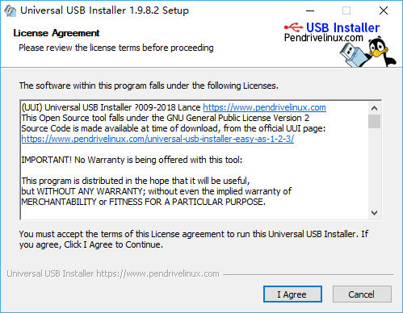
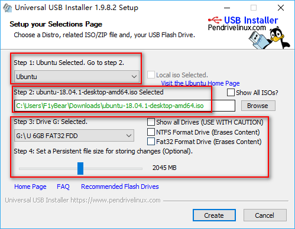
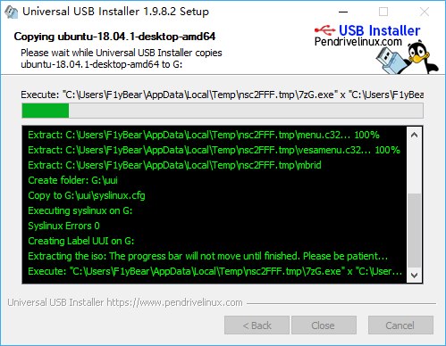

## Ubuntu Ubuntu 18.04 LTS U盘安装图文教程
### 一、 Ubuntu 每年发布两个版本，目前最新正式版版本也升到了 18.04
>下载地址为：https://www.ubuntu.com/download/desktop
###  二、 U盘操作系统安装工具- Universal USB Installer
> 下载地址： http://universal-usb-installer.en.softonic.com/
1.  在Step 1选择Ubuntu，我选择的是64位的。
2.  在Step 2选择 你的Ubuntu镜像.iso文件文件
3.  在Step 3选择 U盘，然后点击 Create
4.  当把Ubuntu镜像.iso 文件全部写入U盘后，Ubuntu U盘启动盘就做成功了。
  
  
  
### 三、 Ubuntu U盘实现U启动安装
```$xslt
注意事项：
1.Ubuntu支持，自定义盘符安装，但是需要在为磁盘创建空白分区，该过程需要在pe或者windows系统下操作。
2.安装Ubuntu时，不要将Ubuntu下的任意一个分区安装在整个磁盘的主分区，否则就会出现丢失Windows的启动项；
3.安装完成后，若丢失Windows的启动项，需要在Ubuntu系统的终端命令符输入:
sudo update-grub
```
